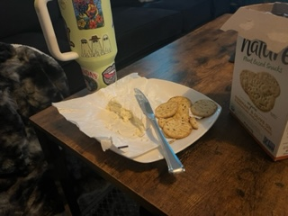

# IDM Web Dev Fall 2023 FINAL PROJECT DOCUMENTATION
# NYC Motion by Ian McCullough
 
[Link to site](https://ianmccullough123.github.io/webDevel/Final/index.html)

# Project Overview
Overview

**Food Lab Preview**

See this [link](https://ianmccullough123.github.io/webDevel/Final/index.html) to interact with the UI!

# Documentation
Documentation

**The JavaScript plugins I've used are:**
- [Typewriter Effect](https://www.npmjs.com/package/typewriter-effect)
- [Flickity Carousels](https://flickity.metafizzy.co/)
- [Simple Parallax](https://simpleparallax.com/)

**Explanation of the HTML elements:**
- \<header\> - explain

**Explanation of the scripts:**

