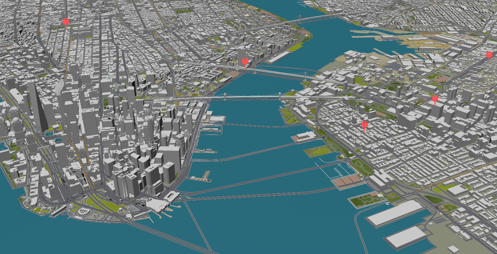

# IDM Web Dev Fall 2023 FINAL PROJECT DOCUMENTATION
# NYC Motion by Ian McCullough
 
[Link to site](https://ianmccullough123.github.io/webDevel/Final/index.html)

# Project Overview
At the start of this project, I found myself at a crossroads, unsure of the creative direction to pursue. Reflecting on the major themes explored throughout our web development course, I landed on net art—a domain that blends technology, interactivity, and art. Motivated by this concept, I wanted to make a digital experience that highlights the aspects of net art that we discussed in class: simplicity, interactivity, and multi-media. By incorporating these principles into my project, I aimed to create a combination of art and technology, offering users a captivating and immersive experience through a virtual landscape. This project allowed me to channel my creativity into a unique and visually website that not only shows my growing skills but also the intersection between technology and artistry.

My project site acts as a tour through new york city, capturing small moments around Brooklyn and Manhattan. The home page serves as a map of the city, incorporating a 3D aspect to make it feel more immersive. Pins are located at photography sites, that when clicked on, redirect you to an interactive page. This second page loads a series of images that are then stitched together to highlight motion is different degrees. By interacting with the html range slider, scrolling on the mouse, or utilizing the added Ping/Pong feature, users are able to scroll through image bursts to view the motion captured in a similar style to a gif. The goal of this page was to bring a third dimenion to what is generally an art form constrained by two dimensions.

**NYC Motion Preview**


See this [link](https://ianmccullough123.github.io/webDevel/Final/index.html) to interact with the UI!

# Documentation

**NOTE:** Please refer to the [link](https://github.com/IanMcCullough123/webDevel/tree/main/Final) to view full code.

## Index.html

### HTML Structure:
- The map page sets up the basic HTML structure with necessary meta tags and a title.
- The CSS styles define a simple, full-screen map with pins representing specific locations throughout the city.

### Styles:
```
<style>
        body {
            margin: 0;
            overflow: hidden;
        }

        #map {
            width: 100vw;
            height: 100vh;
            background: url('map3.jpg') center/cover no-repeat;
            position: relative;
            cursor: pointer;
        }

        .pin {
            width: 50px;
            height: 50px;
            background: url('pin.png') center/cover no-repeat; 
            position: absolute;
            cursor: pointer;
        }
    </style>
```
- The `body` styling removes default margins and overflow.
- The `#map` styling creates a full-screen map with a background image and pins positioned absolutely for interactive elements.

### Interactive Pins:

```
<div id="map">
        <div class="pin" style="top: 47%; left: 70%;" onclick="goToImageDisplay('3840', 'flyingBike', '25')"></div>
        <div class="pin" style="top: 37%; left: 83%;" onclick="goToImageDisplay('3903', 'jay', '9')"></div>
        <div class="pin" style="top: 20%; left: 93%;" onclick="goToImageDisplay('3887', 'church', '12')"></div>
        <div class="pin" style="top: 22.5%; left: 48%;" onclick="goToImageDisplay('3919', 'highway', '12')"></div>
        <div class="pin" style="top: 7%; left: 15%;" onclick="goToImageDisplay('3948', 'wash', '14')"></div>
    </div>
```

- Pins are placed on the map using `div` elements with the class `.pin`.
- Each pin has inline styles for positioning and an `onclick` event calling the `goToImageDisplay` function with parameters for image display.

### JavaScript Function:

```
<script>
        function goToImageDisplay(value, dir, numImages) {
            var encodedValue = encodeURIComponent(value);
            var encodedDir = encodeURIComponent(dir);
            var encodedNumImages = encodeURIComponent(numImages);

            var url = "image-display.html?value=" + encodedValue + "&dir=" + encodedDir + "&numImages=" + encodedNumImages;

            window.location.href = url;
        }
    </script>
```
- The `goToImageDisplay` function encodes parameters and redirects to the "image-display.html" page with the encoded URL.

## Image Display Page (image-display.html)

### HTML Structure:
- The image display page sets up the HTML structure similar to the map page with additional elements for image navigation.

### Styles:

```
<style>
    body {
        font-family: 'Segoe UI', Tahoma, Geneva, Verdana, sans-serif;
        text-align: center;
        margin: 0;
        background: radial-gradient(circle, #3b382f 15%, #fff 140%);
        ...
    }

    #image-slider {
        padding: 35px;
        overflow: hidden;
        ...
        box-shadow: 0 0 10px rgba(100, 100, 100, 0.534);
        max-width: 70%;
    }

    img {
        height: 400px;
        display: block;
        align-self: center;
        margin-bottom: 20px;
    }

    input[type="range"] {
        width: 100%;
        margin-top: 30px;
        -webkit-appearance: none;
        ...
        border-radius: 15px;
        background-color: #e4e4e4;
    }

    input[type="range"]::-webkit-slider-thumb {
        -webkit-appearance: none;
        width: 20px;
        height: 20px;
        ...
        cursor: pointer;
    }

    #play-button, #map-button {
        letter-spacing: 2px;
        font-weight: 800;
        padding: 10px;
        ...
        margin-top: 30px;
    }

    ... more specific button styling...
    
</style>
```

- CSS styling provides an aesthetic and responsive layout. A radial gradient was used on the background of the page.
- `#image-slider` styling defines the appearance of the image slider container, drawing the eye toward the center by using lighter color.

### JavaScript Functions:

#### getParameterValue

```
function getParameterValue(parameterName) {
    var urlParams = new URLSearchParams(window.location.search);
    return urlParams.get(parameterName);
}
```

- Retrieves the value of a parameter from the URL using `URLSearchParams`.

#### preloadImages

```
function preloadImages() {
    for (let i = 0; i <= numImages; i++) {
        const img = new Image();
        img.src = `${dir}/IMG_${parseInt(passedValue) + i}.JPG`;
    }
}
```

- Preloads images on page load using the `Image` object to enhance performance during navigation.

#### Event Listeners:

```
window.addEventListener('load', preloadImages);

slider.addEventListener('input', () => {
    updateImage();
});

document.addEventListener('wheel', (event) => {
    if (event.deltaY > 0) {
        slider.stepUp(100);
    } else {
        slider.stepDown(100);
    }

    updateImage();
});

playButton.addEventListener('click', () => {
    isPlaying = !isPlaying;

    if (isPlaying) {
        playButton.textContent = 'Pong';
        autoPlay();
    } else {
        playButton.textContent = 'Ping';
        clearTimeout(autoPlayTimeout);
    }
});
    
```

- Listens for changes to the slider input, wheel events, and play button clicks to trigger corresponding functions.

#### autoPlay

```
function autoPlay() {
    if (isPlaying) {
        if (parseFloat(slider.value) === parseFloat(slider.max)) {
            sliderRight = false;
        } else if (parseFloat(slider.value) === parseFloat(slider.min)){
            sliderRight = true;
        }

        if (sliderRight){
            slider.stepUp(100);
        }
        else {
            slider.stepDown(100);
        }
        
        updateImage();
        autoPlayTimeout = setTimeout(autoPlay, 100); 
    }
}
```

- Automatically increments or decrements the slider value based on the direction, simulating a slideshow.

#### updateImage

```
function updateImage() {
    const imageNumber = Math.round(slider.value);
    const imagePath = `${dir}/IMG_${parseInt(passedValue) + imageNumber}.JPG`;
    sliderImage.src = imagePath;
}
```

- Updates the displayed image based on the current slider value.

### Initializations:

```
var passedValue = getParameterValue("value");
var dir = getParameterValue("dir");
var numImages = parseInt(getParameterValue("numImages"));

document.getElementById("slider").max = numImages;

var initialImagePath = dir + "/IMG_" + passedValue + ".JPG";
document.getElementById("slider-image").src = initialImagePath;

const slider = document.getElementById('slider');
const sliderImage = document.getElementById('slider-image');
const playButton = document.getElementById('play-button');
let isPlaying = false;
let sliderRight = true;

window.addEventListener('load', preloadImages);
```

- Initializes variables by extracting values from the URL parameters.
- Sets the maximum value of the slider based on the number of images.
- Calls the `preloadImages` function on page load.

## Project Evolution:
When I first came up with the idea for this project, I was trying to think of a way that I could get across to the user the effect that I wanted. My first evolution of the project - my [Prototype](https://ianmccullough123.github.io/webDevel/Final%20Prototype/index.html) - featured cards that contained each of the images in the sequence. The prototype closely resembled a rolodex, with the cards rotating around a central image. However, when implementing this feature, I found that the image transition motion was distracting the user from the actual motion that I had captured. I got a lot of feedback consistent with this problem during the user testing session in class. Many peers suggested that I take a different approach to really highlight the animation aspect of what I was trying to accomplish. To fix this, I decided to keep all images static, and in the same position on the screen. This way, when switching from frame to frame, the content that remains the same from image to image is stationary, allowing the viewer to see the subjects that are in motion.

## Summary:
This project is made up of two interconnected pages — an interactive map leading to an interactive image display page. The map showcases key locations with clickable pins, redirecting users to a visually appealing image slider on the image display page. The JavaScript functions facilitate navigation, preload images for optimal performance, and provide interactive controls for an engaging user experience.

